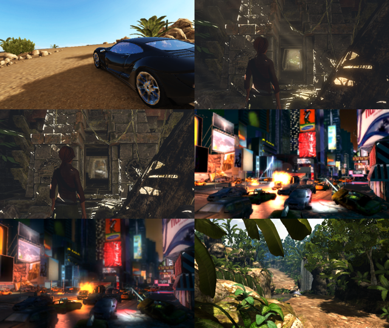
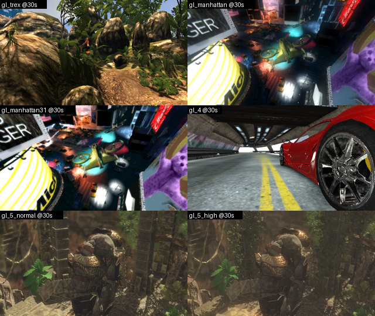
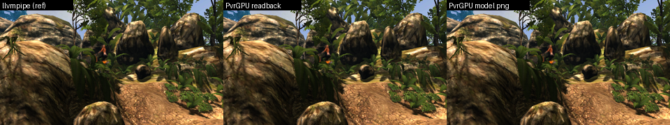

# PVRCarbon

Record GFXBench (open-source GFXBench 5, GLES) with PVRCarbon on a headless
Linux host using Mesa software rendering (llvmpipe; no GPU needed).

## Steps

```bash
scripts/setup_env.sh        # Mesa EGL/GLES 3.2 + Vulkan (lavapipe) + Xvfb
scripts/build_gfxbench.sh   # clone + build Kishonti-Opensource/gfxbench -> tfw-pkg/bin/testfw_app
scripts/run_gfxbench.sh     # run the default test set, 10 frames each
```

`run_gfxbench.sh` accepts test ids (`ls <gfxbench>/tfw-pkg/config`) and the env
vars `FRAMES`, `STEP_MS`, `WIDTH`, `HEIGHT`, `OUT_DIR`, `WRAPPER`.

| test id          | scene              | llvmpipe, 640x360 |
|------------------|--------------------|-------------------|
| `gl_trex`        | T-Rex              | OK, ~1.1 fps      |
| `gl_manhattan`   | Manhattan 3.0      | OK, ~1.3 fps      |
| `gl_manhattan31` | Manhattan 3.1      | OK, ~1.0 fps      |
| `gl_4`           | Car Chase          | OK, ~2.0 fps      |
| `gl_5_normal`    | Aztec Ruins Normal | OK, ~6.9 fps      |
| `gl_5_high`      | Aztec Ruins High   | OK, ~4.5 fps      |

## PVRCarbon

```bash
scripts/install_pvrcarbon.sh   # download (~1.9 GB) + install 2026_R2 to /opt/PVRCarbon (accepts the EULA)
scripts/record_gfxbench.sh     # record each test -> out/recordings/<test>.pvrcbn
```

How GFXBench is hooked (the recorder only sees EGL/GLES):

- `--gfx egl` instead of glfw, which would create a GLX context.
- The recorder's `libEGL`/`libGLESv2`/`libPVRCarbon` are on `LD_LIBRARY_PATH` **and**
  `LD_PRELOAD`, since `testfw_app` links GLVND `libGL.so.1` directly; they forward to
  Mesa (`PVRCARBON_host_library_egl` / `_glesv2`).
- `scripts/glx_to_carbon.c` (built and preloaded by the script) makes GLEW's
  `glXGetProcAddress` lookups return the recorder's `gl*` functions; without it shaders,
  buffers and compressed textures are missing from the recording.

Result with the defaults (10 frames, 640x360); every recording replays in
`PVRCarbonPlayer` with 0 errors and renders the right scene:

| test id          | `.pvrcbn` |
|------------------|-----------|
| `gl_trex`        | 24 MB     |
| `gl_manhattan`   | 58 MB     |
| `gl_manhattan31` | 60 MB     |
| `gl_4`           | 97 MB     |
| `gl_5_normal`    | 108 MB    |
| `gl_5_high`      | 363 MB    |

Inspect a recording with
`/opt/PVRCarbon/CLI/Linux_x86_64/PVRCarbonDump` or `PVRCarbonToTxt`, replay it with
`/opt/PVRCarbon/Player/Linux_x86_64/PVRCarbonPlayer`.



### One sample at 30 s per scene

`AT_MS` renders a fixed animation time (GFXBench `single_frame`) instead of stepping.
Each recording then has 2 frames: frame 0 is the "Loading" screen, frame 1 is the scene at 30 s.

```bash
REC_DIR=out/at30 AT_MS=30000 FRAMES=1 scripts/record_gfxbench.sh
# replay + save frame 1 as PNG
/opt/PVRCarbon/Player/Linux_x86_64/PVRCarbonPlayer --capture-frames=1 \
  --capture-frames-path=out/at30/shots out/at30/gl_trex.pvrcbn
```

Replayed frames: [`docs/at30s/`](docs/at30s/)



## Replay on the PvrGPU model

With [PvrGPU](https://github.com/cclwylin/PvrGPU) set up (`script/setup_linux_env.sh`):

```bash
scripts/replay_on_pvrgpu.sh out/at30/gl_trex.pvrcbn   # -> out/pvrgpu/gl_trex/
```

PVRCarbonPlayer runs `--offscreen` on surfaceless EGL; GLVND is pointed at the PvrGPU
Mesa build (`__EGL_VENDOR_LIBRARY_FILENAMES`) with `GALLIUM_DRIVER=pvrgpu`, and the
SystemC bridge / output variables are set like PvrGPU's `rdc_runner`. Outputs: player
readback PNGs, `driver-command.txt`, `driver-counter.txt`, `model.jsonl`, model PNG.

Full fast/sim results for all six scenes: [docs/pvrgpu_bench.md](docs/pvrgpu_bench.md).

T-Rex at 30 s, `fast` mode: 42 s wall, 40 model submissions, 1.86 ms simulated time,
0 unsupported draws, 0 pool leaks; readback differs from llvmpipe in 0.42 % of pixels
(> 16/255).


