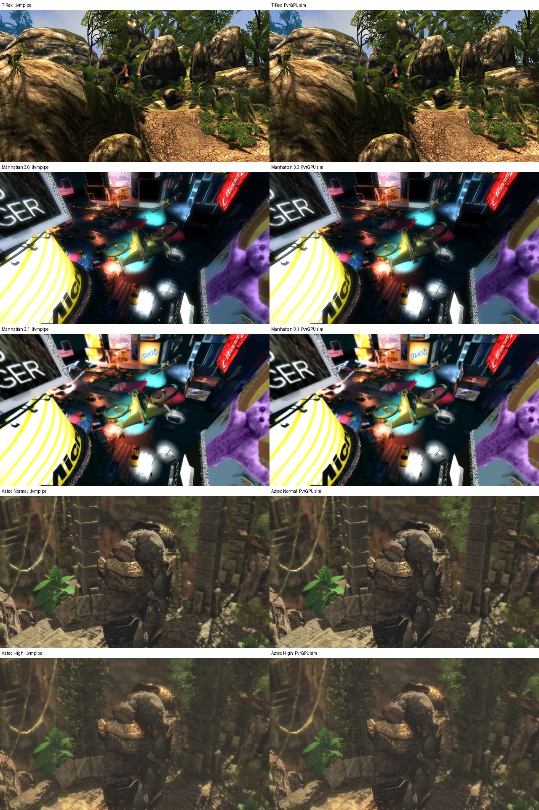

# PvrGPU bench: GFXBench at 30 s

## Single frame at 1920x1080 (comparable to PvrGPU's RenderDoc captures)

The same single-frame method as the 640x360 table below, recorded at the
resolution of the RenderDoc captures in PvrGPU's `docs/LINUX_GFXBENCH.md`
(`3.GFXBench_1Frames`, 1920x1080 Offscreen):

```bash
WIDTH=1920 HEIGHT=1080 AT_MS=30000 REC_DIR=out/at30x3-1080 FRAMES=2 scripts/record_gfxbench.sh
# PVRCarbonTrim --frame-range=2-2 per test (Manhattan 3.0: frame 1-1 of a FRAMES=1 recording);
# Trim replays the recording, so it needs a display (xvfb-run).
REC_DIR=out/at30f-1080 BENCH_DIR=out/pvrgpu-bench-f-1080 REF_DIR=out/at30f-1080/ref scripts/bench_pvrgpu.sh
```

| mode | test | wall (s) | sim time (ms) | submissions | IA prims | PS invocations | peak RSS (GB) | player errors | unsupported | pool leaks | px diff vs llvmpipe (%) |
|---|---|---|---|---|---|---|---|---|---|---|---|
| fast | gl_5_high | 1038 | 75.07 | 37 | 176616 | 40143377 | 2.69 | 0 | 0 | 0 | 0.00 |
| fast | gl_5_normal | 745 | 58.52 | 32 | 146928 | 32451243 | 1.80 | 0 | 0 | 0 | 0.01 |
| fast | gl_manhattan | 340 | 21.77 | 164 | 564978 | 13294759 | 3.46 | 0 | 7 | 0 | 0.03 |
| fast | gl_manhattan31 | 469 | 30.82 | 68 | 316031 | 17591309 | 4.05 | 0 | 0 | 0 | 0.00 |
| fast | gl_trex | 166 | 7.42 | 36 | 669415 | 7303470 | 1.04 | 0 | 0 | 0 | 1.14 |
| sim | gl_5_high | 3117 | 92.85 | 37 | 176616 | 40143377 | 3.09 | 0 | 0 | 0 | 0.00 |
| sim | gl_5_normal | 2168 | 72.30 | 32 | 146928 | 32451243 | 2.43 | 0 | 0 | 0 | 0.01 |
| sim | gl_manhattan | 693 | 27.87 | 164 | 564978 | 13294759 | 3.72 | 0 | 7 | 0 | 0.03 |
| sim | gl_manhattan31 | 946 | 36.77 | 68 | 316031 | 17591309 | 4.21 | 0 | 0 | 0 | 0.00 |
| sim | gl_trex | 249 | 11.25 | 36 | 669415 | 7303470 | 1.14 | 0 | 0 | 0 | 1.14 |

Against the RenderDoc captures (PvrGPU `docs/LINUX_GFXBENCH.md`, model `efab019`;
the captures are not necessarily the frame at 30 s):

| scene | fast: PVRCarbon / RenderDoc | sim: PVRCarbon / RenderDoc |
|---|---|---|
| Manhattan 3.0 | 21.77 / 16.75 ms (1.30) | 27.87 / 23.63 ms (1.18) |
| Manhattan 3.1 | 30.82 / 24.77 ms (1.24) | 36.77 / 36.71 ms (1.00) |
| Aztec Ruins Normal | 58.52 / 47.00 ms (1.25) | 72.30 / 71.34 ms (1.01) |
| Aztec Ruins High | 75.07 / 71.90 ms (1.04) | 92.85 / 110.95 ms (0.84) |

At 640x360 the same frames simulate in 4-7x less time (9.56 / 12.74 ms for
Aztec Normal): the per-pixel work shrinks 9x, geometry and compute do not.
The T-Rex differences at 1080p (1.14 % of pixels) are scattered single texels
on foliage and ground detail, i.e. texture filtering, not missing geometry.



Summary: [`pvrgpu_bench_1080p.json`](pvrgpu_bench_1080p.json).

## Single frame at 640x360 (comparable to a RenderDoc frame capture)

Only the frame at animation time 30 s is replayed. Resources that the
application created or computed while loading are restored from a state
snapshot instead of being recomputed, as a RenderDoc capture does.

- Recordings: `REC_DIR=out/at30x3 AT_MS=30000 FRAMES=2 scripts/record_gfxbench.sh`
  (Loading + two frames at 30 s), then `PVRCarbonTrim --frame-range=2-2`.
  Each trimmed recording replays on llvmpipe pixel-identical to frame 2 of the
  full recording; those replays are the references (`docs/at30f/`).
- Manhattan 3.0: `PVRCarbonTrim` segfaults at the frame-2 snapshot, so it uses
  frame 1 of the two-frame recording (`out/at30`): the same 365 draws as the
  steady frame plus that frame's texture uploads and 21 `glGenerateMipmap`
  calls (hence its 7 declined 3D mip blits and more submissions).
- Car Chase is not included: `PVRCarbonTrim` segfaults at the frame-2
  snapshot, recording only frame 2 (`PVRCARBON_frames=2`) crashes GFXBench,
  and its frame 1 carries the 7,347 load-time compute dispatches. Its frame is
  black on PvrGPU anyway (ASTC cube map array, below).

| mode | test | wall (s) | sim time (ms) | submissions | IA prims | PS invocations | peak RSS (GB) | player errors | unsupported | pool leaks | px diff vs llvmpipe (%) |
|---|---|---|---|---|---|---|---|---|---|---|---|
| fast | gl_5_high | 173 | 11.63 | 37 | 176616 | 6099908 | 2.03 | 0 | 0 | 0 | 0.01 |
| fast | gl_5_normal | 133 | 9.56 | 32 | 146928 | 5196967 | 1.08 | 0 | 0 | 0 | 0.02 |
| fast | gl_manhattan | 77 | 4.25 | 164 | 564978 | 1700459 | 3.26 | 0 | 7 | 0 | 0.03 |
| fast | gl_manhattan31 | 80 | 4.55 | 68 | 316031 | 1968629 | 3.58 | 0 | 0 | 0 | 0.00 |
| fast | gl_trex | 34 | 2.03 | 36 | 669415 | 1005295 | 0.95 | 0 | 0 | 0 | 0.11 |
| sim | gl_5_high | 473 | 16.12 | 37 | 176616 | 6099908 | 2.20 | 0 | 0 | 0 | 0.01 |
| sim | gl_5_normal | 318 | 12.74 | 32 | 146928 | 5196967 | 1.24 | 0 | 0 | 0 | 0.02 |
| sim | gl_manhattan | 138 | 7.15 | 164 | 564978 | 1700459 | 3.34 | 0 | 7 | 0 | 0.03 |
| sim | gl_manhattan31 | 137 | 7.08 | 68 | 316031 | 1968629 | 3.61 | 0 | 0 | 0 | 0.00 |
| sim | gl_trex | 54 | 4.05 | 36 | 669415 | 1005295 | 0.97 | 0 | 0 | 0 | 0.11 |

## Full recordings (Loading + frame at 30 s)

The table below replays everything from application start, including all
load-time work (Aztec's ~2,190 environment-probe compute dispatches, Car Chase's
7,347 in its frame 1), so it is not comparable to a single-frame capture.

`scripts/bench_pvrgpu.sh` over the 30 s PVRCarbon recordings (`out/at30`, frame 0
"Loading" + frame 1 at 30 s), replayed with PVRCarbonPlayer on the PvrGPU Mesa
build. PvrGPU branch `claude/pco-ra-spilling` @ 5ea050e. 4 vCPU, two replays at a time.

| mode | test | wall (s) | sim time (ms) | submissions | IA prims | PS invocations | peak RSS (GB) | player errors | unsupported | pool leaks | px diff vs llvmpipe (%) |
|---|---|---|---|---|---|---|---|---|---|---|---|
| fast | gl_4 | 5129 | 1848.85 | 248 | 908387 | 8392255 | 2.32 | 0 | 14 | 0 | 85.93 |
| fast | gl_5_high | 3694 | 676.78 | 210 | 1074082 | 33236812 | 2.70 | 0 | 0 | 0 | 0.01 |
| fast | gl_5_normal | 2829 | 613.02 | 198 | 551916 | 21763191 | 1.50 | 0 | 0 | 0 | 0.02 |
| fast | gl_manhattan | 74 | 4.28 | 165 | 564980 | 1930859 | 3.28 | 0 | 7 | 0 | 0.03 |
| fast | gl_manhattan31 | 86 | 4.75 | 160 | 316033 | 2346568 | 3.71 | 0 | 7 | 0 | 0.08 |
| fast | gl_trex | 37 | 1.86 | 40 | 669417 | 1454147 | 1.68 | 0 | 0 | 0 | 0.11 |
| sim | gl_4 | 7035 | 2243.96 | 248 | 908387 | 8392255 | 2.36 | 0 | 14 | 0 | 85.93 |
| sim | gl_5_high | 6070 | 942.36 | 210 | 1074082 | 33236812 | 2.85 | 0 | 0 | 0 | 0.01 |
| sim | gl_5_normal | 4496 | 830.61 | 198 | 551916 | 21763191 | 1.68 | 0 | 0 | 0 | 0.02 |
| sim | gl_manhattan | 135 | 7.34 | 165 | 564980 | 1930859 | 3.39 | 0 | 7 | 0 | 0.03 |
| sim | gl_manhattan31 | 142 | 7.50 | 160 | 316033 | 2346568 | 3.72 | 0 | 7 | 0 | 0.08 |
| sim | gl_trex | 57 | 3.66 | 40 | 669417 | 1454147 | 1.69 | 0 | 0 | 0 | 0.11 |

- **sim time**: the model's final cumulative `virtual_time_ns` (includes compute).
- **unsupported**: `event=*unsupported*` records in `driver-counter.txt`.
- **px diff**: pixels of the replayed frame 1 differing from the llvmpipe
  reference (`docs/at30s/`) by more than 16/255 in any channel.

Known gaps:

- **Car Chase (`gl_4`)**: the frame is black. Its environment cube map array is
  ASTC 5x5 (`GL_TEXTURE_CUBE_MAP_ARRAY`, 512x512, 9 cubes); neither the driver's
  sampled-image record (`cube_array_layout_or_sampler`) nor the model's texture
  unit (`ValidateTextureCubeArrayLayout`) accepts a compressed cube array, so 12
  draws and the final full-screen present are declined.
- **Manhattan 3.0 / 3.1**: 7 declined blits each, the scaled mip generation of
  two 3D RGBA8 textures (`no-scale-same-format-rgba-only`); the frame still
  matches llvmpipe within 0.03-0.08 %.
